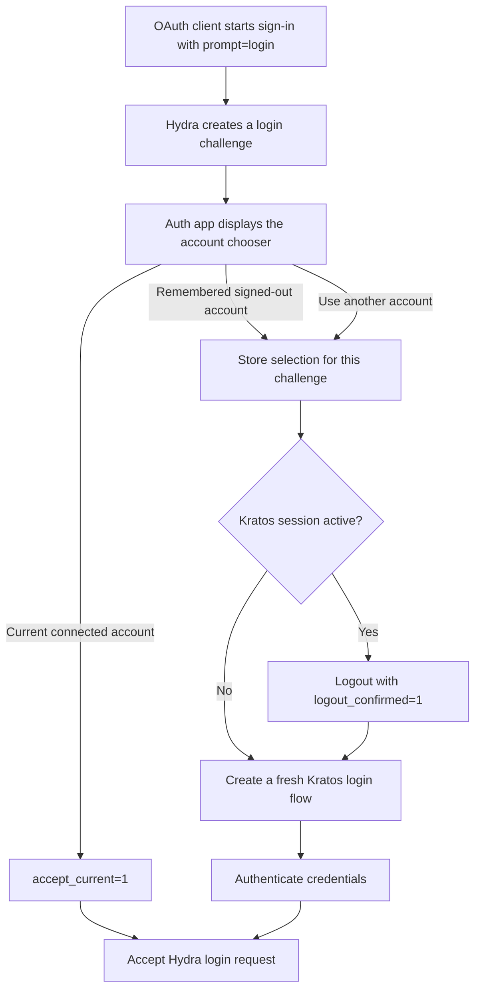

# Ory Auth Next.js App

A Next.js authentication application that acts as both:

- the account experience for Ory self-service flows
- the login and consent UI for Hydra OAuth2/OIDC clients

## 🚀 Features

- **Secure Authentication** - Powered by Ory Identity Platform
- **Modern UI** - Built with Radix UI and Tailwind CSS
- **Full User Management** - Registration, login, password recovery, and email verification
- **Multi-language Support** - Internationalization with next-intl
- **Form Handling** - Robust form management with react-hook-form and Zod validation
- **Responsive Design** - Works seamlessly on all devices
- **Developer Experience** - TypeScript, ESLint, and Prettier configured

## 🛠 Tech Stack

- **Frontend Framework**: Next.js (App Router)
- **Authentication**: Ory Identity Platform
- **Styling**: Tailwind CSS with shadcn/ui components
- **UI Components**: Radix UI, Lucide Icons, Hero Icons
- **Form Handling**: React Hook Form with Zod validation
- **Internationalization**: next-intl
- **Type Safety**: TypeScript
- **Testing**: React Testing Library
- **Package Manager**: pnpm

## Custom account chooser and logout flows

This application adds a Google-style account chooser on top of Ory Hydra and Ory Kratos. This
behavior is application code, not a native multi-account feature provided by Ory.

### Why this is custom

Kratos exposes one active browser session to the application at a time. It does not provide a
browser API that lists previously authenticated identities or a native account chooser. Hydra
owns the OAuth2/OIDC transaction, but delegates the actual login interaction to this application.

Consequently, an account displayed by the chooser is one of two things:

- **Connected**: the identity from the current Kratos browser session.
- **Signed out**: an entry remembered locally after a previous successful consent. It is not an
  active session and does not grant access by itself.

The remembered accounts are only presentation hints. Kratos still verifies credentials and Hydra
still completes the OAuth2/OIDC transaction.

### Sign-in and account selection

OAuth clients that need the account chooser start authorization with `prompt=login`. The auth
application also recognizes `prompt=select_account`, but `prompt=login` is used by our clients
because the chooser is managed here rather than by Hydra or Kratos.



Selecting a signed-out account goes through `/auth/login/account`. That route validates the
selected account against the local history, stores a short-lived selection cookie bound to a
SHA-256 fingerprint of the Hydra login challenge, and starts a fresh Kratos login flow. The cookie
is needed because Kratos redirects back with a new `flow` URL and does not preserve our custom
account chooser parameters. When possible, the selected identifier is prefilled in the Kratos
form.

Selecting the connected account does not create a new Kratos flow. `accept_current=1` explicitly
accepts the current Kratos identity for the active Hydra challenge.

### Logout and account switching

Account switching must first remove the active Kratos browser session. In that context, clicking
another account already expresses the user's intent to disconnect, so the application adds
`logout_confirmed=1` and does not display a second confirmation screen.

A normal logout still displays the confirmation screen. For a Hydra logout, the application first
accepts the Hydra logout challenge and then completes a Kratos browser logout. The internal
`/auth/logout/kratos` route creates and consumes a fresh one-time Kratos logout flow server-side,
forwards its `Set-Cookie` headers, and redirects to the final destination. The raw one-time
`logout_url` is deliberately not exposed as a reusable browser link, which avoids expired-flow
errors when it is requested more than once.

External development redirects are passed through `/auth/logout/complete`. They are restricted to
`http` or `https` URLs on `localhost` and `127.0.0.1`; relative application paths are also allowed.
Production deployments that need absolute cross-origin post-logout redirects must extend this
validation with an explicit trusted-origin allowlist.

### Internal parameters

| Parameter | Owner | Purpose |
| --- | --- | --- |
| `prompt=login` | OIDC | Requires an interactive login; this app uses it to show its account chooser. |
| `prompt=select_account` | OIDC | Also recognized as a request to display the custom chooser. |
| `account_chooser=skip` | This app | Prevents the chooser from being displayed again after a choice was made. |
| `accept_current=1` | This app | Accepts the identity from the active Kratos session for the Hydra challenge. |
| `account_id` | This app | Identifies a remembered account; it is validated against the history cookie. |
| `logout_confirmed=1` | This app | States that the account-switch action already confirmed the logout. |
| `return_to` | Ory / this app | Carries the validated destination after login or logout completion. |

### Application cookies

| Cookie | Lifetime | Purpose |
| --- | --- | --- |
| `ory_auth_account_history` | 1 year | Stores up to eight previously used account labels and identifiers for the chooser. |
| `ory_auth_account_selection` | 10 minutes | Keeps the selected account across Kratos flow redirects and binds it to one Hydra challenge. |

Both cookies are `HttpOnly`, `SameSite=Lax`, and `Secure` in production. They are UX state only and
must never be treated as authentication credentials or authorization evidence.

## 🚀 Getting Started

### Prerequisites

- Node.js 18+
- pnpm
- a running Ory Kratos instance
- a running Ory Hydra instance

### Installation

1. Clone the repository:
   ```bash
   git clone https://github.com/lukyapp/ory-auth-nextjs-app.git
   cd ory-auth-nextjs-app
   ```

2. Install dependencies:
   ```bash
   pnpm install
   ```

3. Set up environment variables:
   Copy `app/.env.example` to `app/.env.local` and update the values:
   ```bash
   cp app/.env.example app/.env.local
   ```

4. Configure the local environment:
   - set `NEXT_PUBLIC_ORY_SDK_URL` to the public Kratos/browser URL exposed to this app
   - set `ORY_SDK_URL` to the server-side SDK URL used by Next.js server code
   - set `ORY_HYDRA_ADMIN_URL` to the Hydra admin URL
   - set `ORY_PROJECT_API_TOKEN` only if your setup requires it

5. Run the development server:
   ```bash
   pnpm dev
   ```

6. Open [http://localhost:3000](http://localhost:3000) in your browser.

## 🏗 Project Structure

```
app/
├── package.json              # Next.js application package
├── src/
│   ├── app/
│   │   ├── api/              # API routes
│   │   └── (app)/auth/       # Authentication pages
│   └── lib/ory/              # App-specific Ory configuration and locale glue
packages/
├── ory-elements-react/       # Local copy of @ory/elements-react
├── ory-nextjs/               # Local copy of @ory/nextjs
└── ory-sdk/                  # Local server-side Ory SDK adapter package
```

## 🔍 Usage

### Available Scripts

- `pnpm dev` - Start development server
- `pnpm build` - Build for production
- `pnpm start` - Start production server
- `pnpm lint` - Run ESLint
- `pnpm typecheck` - Run TypeScript type checking

Root scripts delegate to the `app` workspace package. You can also run commands explicitly with
`pnpm --filter app <script>`.

### Environment Variables

The app currently validates these variables at startup:

```bash
NEXT_PUBLIC_ORY_SDK_URL=http://localhost:4433
ORY_SDK_URL=http://kratos:4433
ORY_HYDRA_ADMIN_URL=http://hydra:4445
ORY_PROJECT_API_TOKEN=optional
```

Notes:

- `NEXT_PUBLIC_ORY_SDK_URL` is used by browser-side Ory code
- `ORY_SDK_URL` is used by server-side Next.js code
- `ORY_HYDRA_ADMIN_URL` is used for Hydra login and consent challenge handling
- `ORY_PROJECT_API_TOKEN` is optional in the current validator
